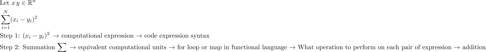

Introduction to Computational Thinking Repository
================

There is an increasing evidence that the learning capacity of the brain
increase through activities that challenges current learning capacity,
like solving new problems with varied complexity, persistence,
perseverance, and growth mindset. In addition, the half-life time-period of the industry relevant skills has reduced to a shorter time
frame. Therefore, to solve a business relevant problem the skills needs
to be continuously upgraded. So, the modern workforce requires people to
be continuously motivated to learn new skills. A good habits keeps the
inertia of learning new things under check, which underlies the core
philosophy behind maintaining this repository. The main motivations to
maintain this repository: 
* Perform Exercises to extend the limits of
learning capacity.  
* Keep practicing fundamentals.  
* Continue the process of creating knowledge chunks for developing
innovation skills to solve problems.  
* Portfolio to highlight skills for the hiring managers.  
* Create some set of reusable codes, which could also be found helpful
for other practitioners.

## Pedagogy for Developing Solution

The section outlines the sketch of approaching a computational problem.
The steps are not rules, but a heuristic, which provides a framework for
solving the problems. The pedagogy to solve can be broken down into
following steps.

#### Understand the problem

  - Identify the task.
  - Formulate mathematically.
  - Develop first intuition of computation tasks.
  - Develop programming language independent understanding of the problem by
    breaking the problem into small computational units.
  - Simple Exemplar: Evaluate the Sum Square Error between two vectors.

At first glance it will look as overhead, but this extra step I have
found very helpful in solving scientific computing problems like solve
QR decomposition or problems listed on Project Euler. I ended up
developing more comprehensive perspective about the problem and saving
time in reaching to solution.

#### Write Pseudo-code

  - Identify correct data structures based on problem properties and
    assumptions.
  - Write steps of the pseudo-code.

#### Develop Code

Use chosen programming language to code the syntax for the problem.

#### Languages Used

  - F\# functional language in .Net framework
  - Python
  - R
  - Julia
  - MATLAB/Octave

Given changing requirements the important skills is to switch between
languages or technology depending upon the use case. However, what the
core mathematical concepts remain the same even if language or
technology change or evolve. The recipe to switch between languages is  
`Identify the basic building blocks to accomplish in the favourite
language and draw analogy to find equivalent methods in the new language
to accomplish the task. This is important skill to develop that is using
analogy to translate code in new language.`

## References

  - Dweck, Carol S. Carol Dwecks Mindset: The New Psychology of Success:
    Summary. Place of Publication Not Identified: Ant Hive Media, 2016.
  - Bornemann, Folkmar. The SIAM 100-digit Challenge: A Study in
    High-accuracy Numerical Computing. Philadelphia: Society for
    Industrial and Applied Mathematics, 2004.
  - Sanjoy Mahajan, The Art of Insight in Science and Engineering:
    Mastering Complexity, MIT Press, 2014.
  - Sanjoy Mahajan, Street-Fighting Mathematics: The Art of Educated
    Guessing and Opportunistic Problem Solving, MIT Press, 2010.
  - Polya, George. How to solve it: A new aspect of mathematical method.
    No. 246. Princeton university press, 2004.
  - Briggs, William. “Ants, Bikes and Clocks.” SIAM, Philadelphia
    (2005): 20.
  - Trefethen, L. N. “The SIAM 100-Dollar, 100-Digit Challenge.” The
    SIAM 100-Dollar, 100-Digit Challenge. Accessed January 13, 2019.
    <https://people.maths.ox.ac.uk/trefethen/hundred.html>.
  - Hughes, Colin. “Project Euler.” Project Euler. Accessed January 13, <https://projecteuler.net/>.
  - “HackerRank.” HackerRank. Accessed January 13, 2019.
    <https://www.hackerrank.com/>.
